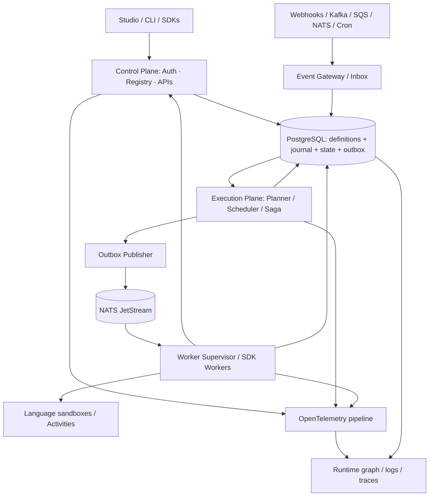

# System architecture — overview

## Context and boundaries

**Actors:** Workflow Author, Platform Operator, Security Admin, API Client, Human Approver, SDK Worker and Connector Provider.

**Layers/planes**



The diagram is **logical**: workers confirm results via the Command API; they must not receive direct database credentials in the default deployment. The `WR → DB` arrow represents an effect persisted via API in the default case (or via a privileged worker adapter in an internal deployment).

## Bounded contexts

| Context | Logical owner | Main interface | Data |
|---|---|---|---|
| Identity/Workspace | control-plane | RBAC, namespaces | tenants, users, roles |
| Definition Registry | control-plane | draft/publish/version | workflow_versions |
| Execution | engine | commands, state, journal | runs, steps, attempts, events |
| Saga | engine | compensation policy | saga_entries, saga_runs |
| Scheduler | engine | ready timers and leases | timers, queues, leases |
| Event Gateway | integration plane | inbox, correlations | events, subscriptions |
| Script Registry | control-plane | build, publish, digest | scripts, artifacts |
| Worker Supervisor | execution plane | register, lease, heartbeat | workers, capabilities |
| Connector Registry | integration plane | credentials, subscriptions | connectors, deliveries |
| Observability | read-side | projection, query, OTel | execution read models |

## Key invariants

1. A published `WorkflowVersion` is immutable and every Run references a single version.
2. A step command (`step_id`, `attempt`) is accepted once per generation/fencing token.
3. A RUNNING→WAITING transition persists the subscription/timer in the same transaction.
4. NATS carries `task_ref`, never the sole record of a task. Redelivery is normal.
5. A reconciliation loop re-emits outbox and detects READY tasks without delivery.
6. Runtime DAG is event-projected; the definition graph is a blueprint and may omit branches not taken.

## Monorepo decomposition (planned)

```text
Cargo.toml                         # workspace Rust
apps/control-plane/
apps/execution-engine/
apps/worker-supervisor/
crates/domain/
crates/application/
crates/infra-postgres/
crates/infra-nats/
crates/scheduler/
crates/saga/
crates/events/
crates/script-registry/
crates/sandbox/
crates/connectors/
crates/telemetry/
crates/api-http/
crates/api-grpc/
proto/sagat_octopus_orchestrator/v1/
frontend/apps/studio/
frontend/packages/ui/
sdks/typescript/
sdks/go/
sdks/python/
sdks/dotnet/
sdks/java/
infra/docker/
infra/helm/
tests/{contract,integration,fault,performance,e2e}/
```

## V1 vertical slice

Publish declarative JSON definition → start Run via REST → persist journal → enqueue task → test worker executes → complete step → update state → view graph and audit log → kill and restart worker with safe retry.

## Explicit scope left for later releases

Generic low-code style application designer, public connector marketplace, WASM as a mandatory runtime, multi-region active-active, bidirectional conversion of arbitrary imperative code and global distributed transactions.
