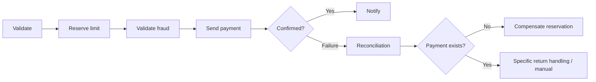

# Formal model of Sagas, compensation and reconciliation

## Concepts

- `SagaRun`: business scope associated with a Run (may include sub-Sagas).
- `ForwardAction`: operation with an external effect, confirmation contract and idempotency.
- `CompensationAction`: new operation that attempts to neutralize/compensate the previous one; it is not an ACID rollback.
- `CompensationPlan`: stack ordered by dependency in reverse topological order, and not just a reversal of an array for parallel branches.
- `CompensationOutcome`: COMPLETED, PARTIAL, FAILED, NOT_POSSIBLE, MANUAL_REVIEW.

## Mandatory rules

1. Record the intent and the compensation handle before considering the action confirmed (or in the same transaction as the success checkpoint).
2. If an external action is left in an ambiguous state, run reconciliation before compensating or advancing; never assume it did not occur.
3. Each compensation receives a `compensation_idempotency_key` stable per Run/Step/Action.
4. Compensation failure allows a separate retry with backoff and limit; when exceeded, `COMPENSATION_FAILED` and audited human intervention.
5. In parallel branches, compensations of independent branches may run in parallel if dependencies allow; conflicts require serialization.
6. On cancellation, policy `ABORT_NO_COMPENSATION`, `COMPENSATE_COMPLETED`, `WAIT_IN_FLIGHT_THEN_COMPENSATE`; recommended default `COMPENSATE_COMPLETED`, respecting irreversible effects.
7. For settled payments, 'compensating' may open a distinct return process and not mark success until confirmation is obtained from the domain.

## Example



## Proposed DSL (illustrative API, no existing implementation)

```typescript
saga('corporate-payment').step('reserve', {
  execute: reserveLimit,
  compensate: releaseLimit,
  idempotencyKey: ({runId}) => `reserve:${runId}`,
  retry: { maxAttempts: 4, backoff: 'exponential', jitter: true }
}).step('submit', {
  execute: submitPayment,
  reconcile: lookupPaymentStatus,
  compensate: requestReturnIfSupported,
  irreversibleAfter: 'settled'
});
```

## Example with C# (illustrative API)

```csharp
var reservation = await saga.StepAsync(
    "reserve-limit", ct => limits.ReserveAsync(request, ct),
    compensate: ct => limits.ReleaseAsync(request.IdempotencyKey, ct));
await saga.StepAsync(
    "send-payment", ct => payments.SubmitAsync(request, ct),
    reconcile: ct => payments.GetStatusAsync(request.IdempotencyKey, ct));
```

## Minimum test scenarios

- failure in the second step → compensation of the first;
- failure after executing and before saving the response → reconciliation before retry;
- compensation failure → backoff and intervention;
- parallel with join and compensation of one branch;
- cancellation during an in-flight activity;
- operator requests retry/skip with `reason` and approval; no change to the past journal.
