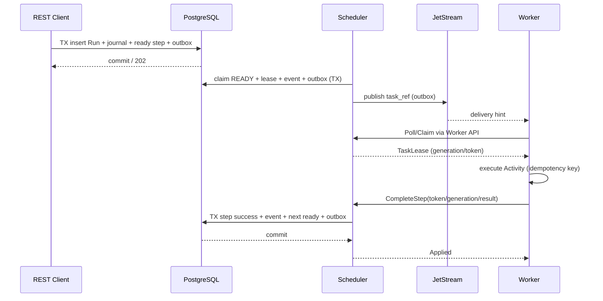

# Worker, leasing and fencing protocol — details

## Session and capabilities

`RegisterWorker` authenticates the machine/namespace identity, negotiates `protocol_version`, capabilities (`activity_names`, `languages`, `pools`, `max_inflight`) and returns a session with TTL. A worker does not execute a task that declares a capability it lacks.

## Claim

NATS delivery is a **hint**. The worker calls `PollTasks`/stream, which performs a transactional claim in Postgres; the response carries an opaque `lease_token`, `generation`, `attempt`, `deadline` and `idempotency_key`. A NATS callback does not constitute authority to execute without a valid lease.

## Worker loop

```text
connect → register → request credits → claim one or more tasks
for each task:
  validate protocol/tenant scope, deadline, capabilities
  start heartbeat loop (lease renewal)
  execute Activity or Script in isolated executor with deadline
  upload large result to object storage (hash verified)
  CompleteStep or FailStep with token+generation+idempotency_key
  if STALE_ATTEMPT: ignore persisted result, stop executor, emit metric
  ack local delivery; read next tasks respecting max_inflight
```

## Lease settings

- Proposed default parameters: `lease_ttl=30s`, `heartbeat_interval<=lease_ttl/3`, `max_lease_renewal` per step timeouts.
- Heartbeats do not persist the full journal per heartbeat; they renew the row via a lightweight update with fencing.
- A worker that lost its connection may continue the side effect; a stale token prevents the **internal commit**, but does not undo the side effect. The SDK recommends cancel + idempotency for external APIs.
- Task released again after expiration with `generation+1`. An old response receives `STALE_ATTEMPT`.
- Long polling/backoff avoids busy-looping; gRPC streaming can be added without changing semantics.

## Failing step

- `retryable=true`: consume retry budget and schedule `next_attempt_at` with backoff/jitter.
- `retryable=false`: progression to the onError branch, saga compensation or fail policy.
- `deadline_expired`: best-effort cancel and persisted temporal state; if the external effect is unknown, reconciliation is mandatory for a critical connector.
- `fail` and `complete` with the same repeated key return the previously recorded outcome; different request hash under the same key = conflict.

## Flow control

- Local credit control per worker and global quotas per tenant/queue/connector.
- Expose `max_inflight` and capacity dynamically; the scheduler cannot trust in-memory counters after failover.
- Distribution by capability without a subject per run, for bounded queue cardinality.

## Success flow



## Warning: double grant

The diagram above illustrates claim and delivery in the same chain; the implementation must ensure that the lease is delivered **logically only once**, via one canonical operation. Recommended option: the scheduler only creates the READY/outbox hint, and the worker API performs the READY→LEASED transition under lock. Do not implement a prior claim by the scheduler and a second claim by the worker simultaneously. If opting for pre-assignment, write an ADR and corresponding fencing tests.

### Final V1 decision

**The V1 choice is:** the engine writes `READY` + outbox; NATS wakes the worker; the Worker API grants `LEASED` under row lock/CAS and returns the token. The worker executes, renews the heartbeat and confirms. The reconciler re-notifies READY without an active hint and releases expired leases. The "SCH claim READY" step in the diagram above must be interpreted as scheduler validation, not as a lease grant prior to the worker API.
