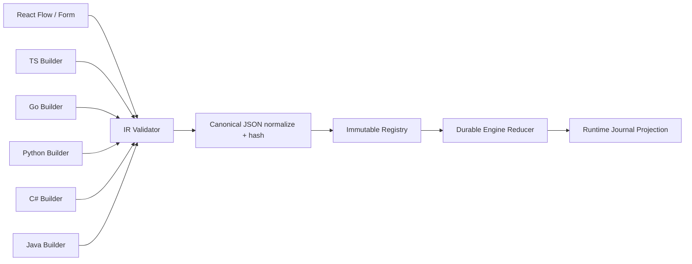

# Authoring model: IR, SDK, inline scripts and execution graph

## Three experiences, a single engine

| Experience | Flow definition | Orchestration logic executor | Executes arbitrary code | Rendering |
|---|---|---|---|---|
| Visual-first | JSON IR via Studio | Rust engine | Yes, in isolated Activity/Script nodes | Complete static graph + execution |
| Declarative code-first | SDK builder compiles/publishes JSON IR | Rust engine | Yes, BYO worker Activities or Script | Complete static graph + execution |
| Procedural code-first (later phase) | Workflow function with deterministic commands | SDK worker + engine journal | Yes, strictly side-effect steps | Observed dynamic graph, partial blueprint |

The V1 goal is the first two modes. The procedural mode requires a formal determinism spike per language; it is not a hidden V1 requirement.

## Compilation pipeline



The SDK pipeline may run client-side and publish IR to the server. It must not execute business side effects during compilation. JSON canonicalization defines stable sorting of objects, ordered preservation of arrays and explicit representation of decimals.

## v1 node kinds

| Node | Essential input | Semantics | Error/limit |
|---|---|---|---|
| `activity` | activity ref, input mapping | durable external task | retry, timeout, idempotency |
| `script` | artifact digest | sandbox via worker | build version / quotas |
| `condition` | safe CEL expression | decides edge | expression without side effects |
| `parallel` | branches, join policy | fanout with barrier | concurrency/fairness |
| `foreach` | collection, iteration key | repeats subgraph | item limit |
| `timer` | delay/until | creates temporal subscription | timezone when scheduled |
| `waitEvent` | type/key/timeout | waits on subscription | race with deadline |
| `child` | workflow id+version policy | starts child run | cancel propagation |
| `saga` | start, compensation policy | compensation domain | irreversible actions |
| `humanApproval` | form schema, assignee policy | waits for signal/authorization | SLA/escalation |
| `end` | output mapping | terminal closure | output validation |

**Note:** schema v1 already describes these node kinds; validation of references, typing between nodes and security rules require an additional semantic validator on the server.

## TypeScript builder model (design API)

```typescript
const flow = workflow('procure-to-pay')
  .trigger.webhook('erp/invoice.created')
  .step('validate', activity('invoice.validate'))
  .saga('settlement', saga => saga
     .step('reserve', activity('limits.reserve'), {
        compensate: activity('limits.release'),
        reconcile: activity('limits.lookup')
     })
     .step('send', activity('payments.submit'), {
        reconcile: activity('payments.getStatus'),
        compensate: activity('payments.requestReturn')
     }))
  .waitForEvent('payment.confirmed', { key: '$.input.paymentId', timeout: '5m' })
  .step('notify', script('customer-notification@sha256:...'));
await client.definitions.publish(flow.compile());
```

## C# builder (design API)

```csharp
var flow = Workflow.Define("procure-to-pay")
   .Trigger(Trigger.Webhook("erp/invoice.created"))
   .Activity("validate", "invoice.validate")
   .Saga("settlement", saga => saga
       .Activity("reserve", "limits.reserve", compensateWith: "limits.release")
       .Activity("send", "payments.submit", reconcileWith: "payments.getStatus"))
   .WaitForEvent("payment.confirmed", "$.input.paymentId", TimeSpan.FromMinutes(5))
   .Activity("notify", "customer.notify");
await client.PublishAsync(flow.Compile(), cancellationToken);
```

## Canvas consistency

- Editor and builder generate the same normalized IR form; differences only in layout metadata.
- A script code change generates a new artifact digest; a definition change generates a new version.
- The runtime graph includes dynamically generated steps, retry attempts and compensations even if they are not in the blueprint.
- Reprocessing a node does not edit the historical run: it generates a new attempt in the same Run when legal, or a new Run explicitly.
- If a feature is not expressible in visual IR (for example arbitrary imperative control), the UI displays `Code-orchestrated`, with runtime observation and explicit limitations.

## Compilation and validation

1. Parse schema and resolve typed inputs/outputs.
2. Verify existing `entrypoint`, unique IDs, valid targets, no dangling edges.
3. Validate cycles only inside a declared `foreach`/loop with an iteration limit and stable checkpoint.
4. Verify Saga compensations/reconcile for operations marked `external_effect`.
5. Define capability/secret/egress and validate RBAC of dependencies.
6. Normalize IR, compute digest, sign the version and publish atomically.
